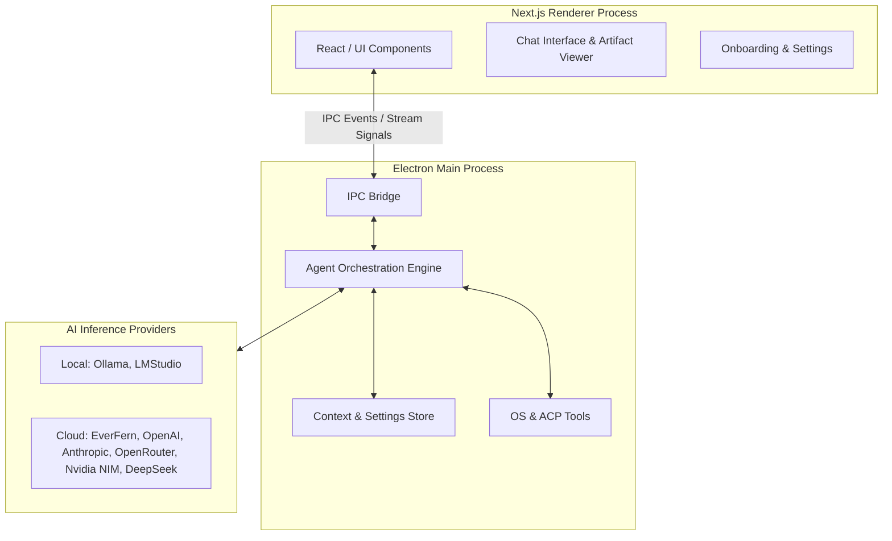
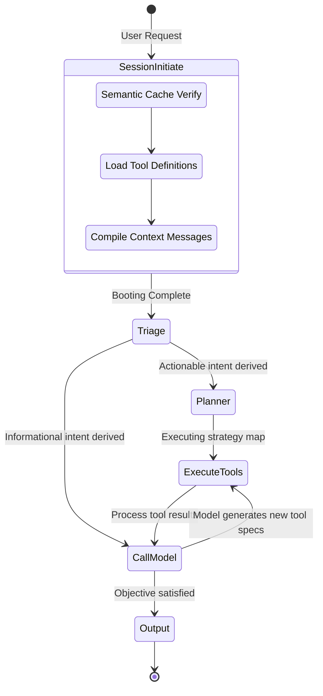

# EverFern Desktop

EverFern Desktop is a next-generation intelligent OS orchestration platform. It is an AI-first desktop application designed with an asynchronous executing graph (Agent Runner), providing autonomous system tools, robust high-fidelity telemetry, and intelligent context persistence.

The application relies on a dual-process architecture:
- **Backend**: An Electron Main Process orchestrating the AGI graph, tools, and local OS-level operations.
- **Frontend**: A Next.js (App Router) Renderer Process driving a highly dynamic, glassmorphic streaming UI.

## Architecture Overview



### Core Components

1. **Next.js Real-time Frontend (`src/app`)**
    - **Streaming UI**: Leverages an SSE-like abstraction over Electron's IPC bridge to stream text tokens, logic fragments, and tool-call indicators seamlessly.
    - **Artifact Rendering**: Contains a rich visualization engine (`ArtifactsPanel`, `DiffViewer`, `PlanViewerPanel`) allowing high-quality interactive preview formatting for diffs, code implementations, and execution walkthroughs.

2. **Graph-Based Agent Engine (`main/agent/runner`)**
    - The engine bypasses traditional simple loops in favor of a **LangGraph-inspired state-machine graph**. It decomposes abstract tasks, actively plans discrete execution steps, invokes dynamic models, and processes OS-side-effects resiliently across different nodes.
    - Available nodes include:
        - `Triage`: Classifies user intent, computes context window limits, and intelligently decomposes requirements.
        - `Planner`: Compiles deterministic steps to generate actionable pipelines.
        - `Execute Tools`: Resolves schema matches to invoke file, search, and OS shell commands iteratively and concurrently.
        - `Call Model`: Evaluates active state boundaries across vision (VLM) or standard LLMs.

3. **Telemetry Logger (`main/agent/helpers`)**
    - An animated command-line proxy logger configured natively in `telemetry-logger.ts`. It provides high-fidelity insight into backend agent behavior (Node transitions, Cache lookup hits, Context Token pressure, Iteration timers, Resource checks).

## AGI Execution Node Workflow



## Development & Build Instructions

### Prerequisites
- Node.js (v18 or higher)
- npm / yarn / pnpm

### Getting Started

Install modules and start the development cluster. Behind the scenes, the run script spawns the React rendering engine alongside the TS-monitored Electron main backend simultaneously.

```bash
npm install
npm run dev
```

There is an ongoing reliance on native environment settings (`NEXT_TELEMETRY_DISABLED=1` and `UV_THREADPOOL_SIZE`).

### Local Provider Mapping
The application has built-in integration classes catering to multi-provider fallbacks. Current integrations managed within `main/lib/providers.ts` scale across:
- **Local Targets:** Ollama, LMStudio.
- **Remote Providers:** EverFern Native, OpenAI, Google Gemini, Anthropic, DeepSeek, OpenRouter, and Nvidia NIM.

If you are expanding inference, register the new engine ID in the `ProviderType` configuration bound to `main/acp/types.ts`.

## Privacy & Footprint
The architecture treats local directories strictly. All key vaults, application statuses, and context history stores live in your localized filesystem footprint (primarily nested within `~/.everfern/store`). No secrets leave your desktop.
