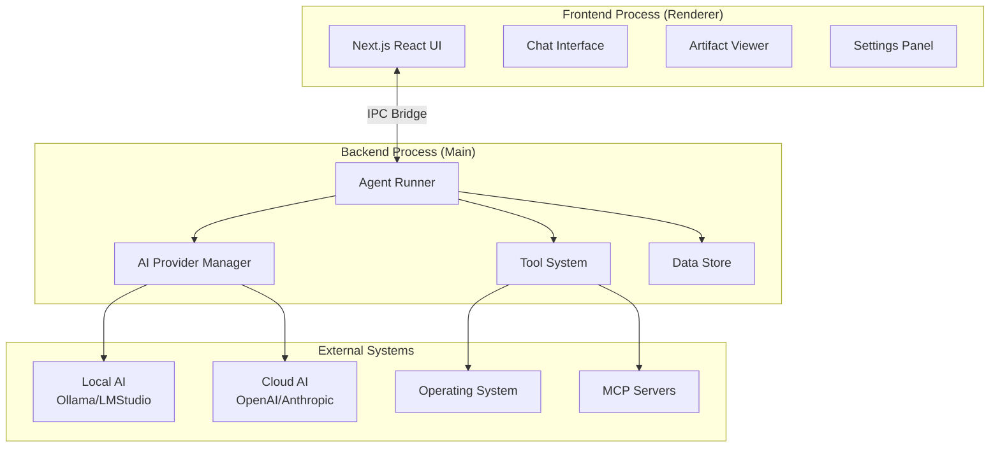
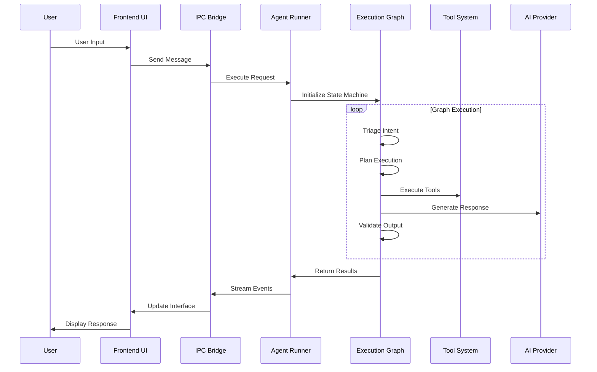
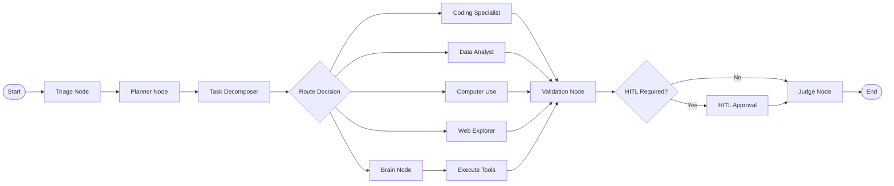
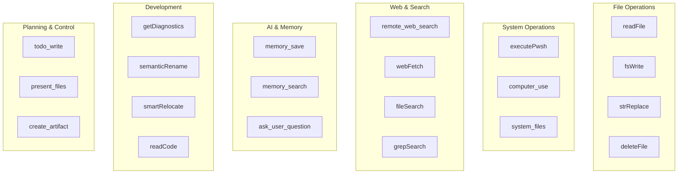
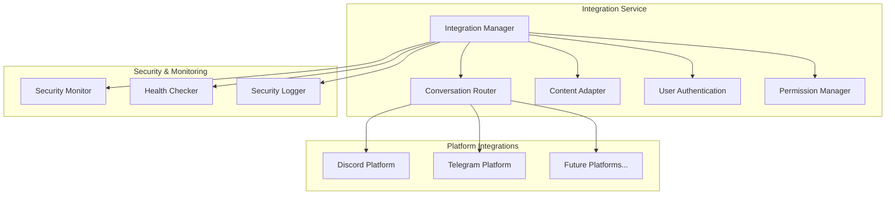
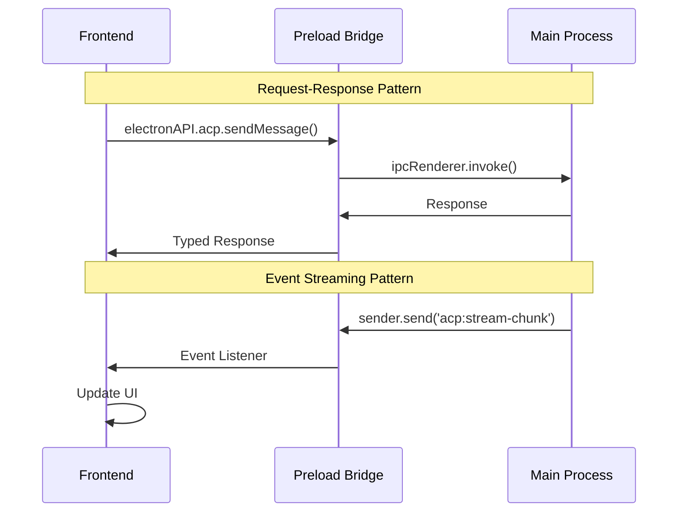
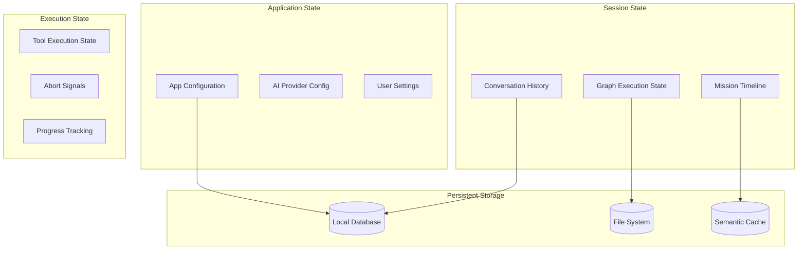
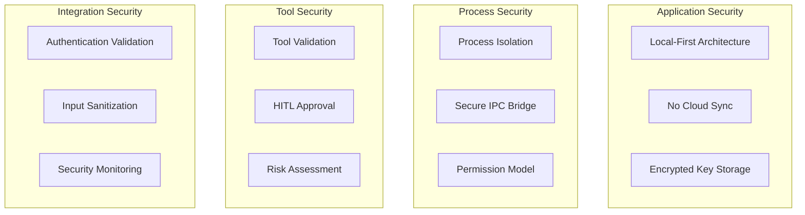

# EverFern Architecture Documentation

> Comprehensive technical documentation of EverFern's architecture, design patterns, and system components.

This directory contains detailed architectural documentation for EverFern, a sophisticated desktop AI agent built on a dual-process Electron architecture with a graph-based execution engine.

## 📋 Table of Contents

- [System Overview](#system-overview) - High-level architecture and design principles
- [Core Components](#core-components) - Detailed component documentation
- [Data Flow](#data-flow) - How data moves through the system
- [Agent System](#agent-system) - Graph-based execution engine
- [Tool System](#tool-system) - Tool architecture and execution
- [Integration System](#integration-system) - Multi-platform integrations
- [IPC Communication](#ipc-communication) - Inter-process communication
- [State Management](#state-management) - Session and state handling
- [Security Model](#security-model) - Privacy and security architecture

## 🏗️ System Overview

EverFern is built on a **dual-process architecture** optimized for AI workloads, combining the power of Electron's desktop integration with Next.js's modern web technologies.

### Key Design Principles

1. **Privacy-First**: All data stays local, no cloud sync
2. **Modularity**: Loosely coupled components with clear interfaces
3. **Extensibility**: Plugin architecture via MCP protocol
4. **Performance**: Parallel execution and intelligent caching
5. **Reliability**: Robust error handling and recovery mechanisms

## 🔧 Core Components

### 1. Agent Execution Engine
- **Location**: `main/agent/runner/`
- **Technology**: LangGraph state machine
- **Purpose**: Orchestrates complex AI workflows through specialized nodes

### 2. Tool System
- **Location**: `main/agent/tools/`
- **Count**: 30+ built-in tools
- **Purpose**: Provides AI agents with system capabilities

### 3. AI Provider Management (ACP)
- **Location**: `main/acp/`
- **Providers**: 9+ supported (OpenAI, Anthropic, Ollama, etc.)
- **Purpose**: Unified interface for AI model interactions

### 4. Integration Service
- **Location**: `main/integrations/`
- **Platforms**: Discord, Telegram, and more
- **Purpose**: Multi-platform bot and messaging integration

### 5. IPC Communication Layer
- **Location**: `preload/preload.ts`, `main/ipc/`
- **Protocol**: Electron IPC with typed interfaces
- **Purpose**: Secure communication between processes

## 📊 Data Flow

The system processes user requests through a sophisticated pipeline:

## 🤖 Agent System

The agent system is built on a **graph-based state machine** using LangGraph, providing sophisticated workflow orchestration.

### Execution Nodes

### Specialized Agents

Each specialized agent has its own dedicated implementation and system prompt:

| Agent | Purpose | Key Tools | Capabilities |
|-------|---------|-----------|--------------|
| **Coding Specialist** | Code generation, debugging, refactoring | fsWrite, strReplace, readCode, getDiagnostics | Full-stack development, testing, architecture |
| **Data Analyst** | Data processing and visualization | terminal_execute, fsWrite, readFile | Statistical analysis, ML, dashboard creation |
| **Computer Use** | GUI automation and desktop interaction | computer_use | Application control, file operations, UI interaction |
| **Web Explorer** | Web research and content extraction | web_search, webFetch | Information gathering, fact verification |

## 🛠️ Tool System

The tool system provides AI agents with capabilities to interact with the operating system, web, and external services.

### Tool Categories

### Tool Execution Pipeline

1. **Validation**: Check tool availability and permissions
2. **HITL Check**: Determine if human approval is required
3. **Execution**: Run tool with proper error handling
4. **Result Processing**: Format and validate output
5. **State Update**: Update graph state with results

## 🔌 Integration System

EverFern supports multi-platform integrations through a modular service architecture.

### Integration Architecture

### Platform Support

- **Discord**: Bot integration with slash commands and webhooks
- **Telegram**: Bot API integration with message handling
- **Extensible**: Plugin architecture for additional platforms

## 📡 IPC Communication

Inter-process communication between the frontend and backend uses Electron's IPC with a typed bridge.

### Communication Patterns

### Event Types

- **Stream Events**: Real-time AI response streaming
- **Tool Events**: Tool execution progress and results
- **Mission Events**: Task progress and timeline updates
- **System Events**: Provider status, errors, notifications

## 💾 State Management

EverFern manages multiple types of state across different scopes and lifecycles.

### State Hierarchy

### State Persistence

- **Configuration**: Stored in `~/.everfern/config.json`
- **Conversations**: SQLite database with semantic caching
- **Artifacts**: File system with metadata indexing
- **Cache**: LRU cache with TTL for API responses

## 🔒 Security Model

EverFern implements a comprehensive security model focused on privacy and data protection.

### Security Layers

### Security Features

- **Local-First**: All data remains on user's machine
- **Encrypted Storage**: API keys and sensitive data encrypted at rest
- **HITL Approval**: Human-in-the-loop approval for high-risk operations
- **Process Isolation**: Frontend and backend run in separate processes
- **Permission Model**: Granular permissions for tool execution

## 📈 Performance Optimizations

EverFern includes several performance optimizations for responsive AI interactions:

### Optimization Strategies

1. **Parallel Execution**: Independent tools run concurrently
2. **Semantic Caching**: Reduce redundant API calls
3. **Context Window Management**: Intelligent message pruning
4. **Graph Checkpointing**: Resume capability for long tasks
5. **Provider Pooling**: Connection reuse for AI providers

### Performance Monitoring

- **Telemetry System**: Detailed performance metrics
- **Mission Tracking**: Timeline visualization for debugging
- **Resource Monitoring**: CPU, memory, and token usage tracking

## 🔧 Development Guidelines

### Adding New Components

1. **Agents**: Create in `main/agent/runner/agents/` with corresponding prompt
2. **Tools**: Implement in `main/agent/tools/` with proper validation
3. **Integrations**: Add to `main/integrations/` with security checks
4. **UI Components**: Create in `src/components/` with TypeScript

### Testing Strategy

- **Unit Tests**: Individual component testing
- **Integration Tests**: Cross-component interaction testing
- **Property-Based Tests**: Correctness validation
- **E2E Tests**: Full workflow testing

### Code Quality

- **TypeScript**: Strict type checking enabled
- **ESLint**: Code quality and consistency
- **Prettier**: Automated code formatting
- **Documentation**: Comprehensive inline documentation

---

## 📚 Additional Resources

- [Agent System Deep Dive](./agent-system.md) - Detailed agent architecture
- [Tool Development Guide](./tool-development.md) - Creating custom tools
- [Integration Guide](./integration-guide.md) - Adding platform integrations
- [Performance Tuning](./performance-tuning.md) - Optimization strategies
- [Security Best Practices](./security-guide.md) - Security implementation details

---

**Last Updated**: January 2025
**Version**: 2.0.0
**Maintainers**: EverFern Core Team
