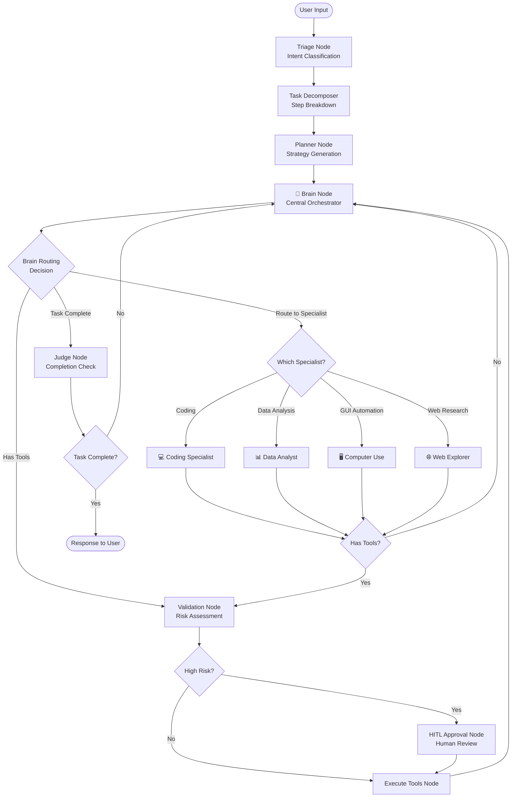

# Agent System Architecture

> Deep dive into EverFern's graph-based agent execution engine and specialized agent implementations.

## Overview

EverFern's agent system is built on a sophisticated **graph-based state machine** using LangGraph, providing intelligent task orchestration through specialized agents and dynamic tool execution.

## Core Architecture

### Execution Graph Structure (Brain-Centric Routing)



**Key Innovation**: The Brain Node is now the **central orchestrator** that makes all routing decisions after analyzing the task and response. All specialized agents route back to the Brain for coordination, creating a unified control flow.

## Node Implementations

### 1. Triage Node (`triage.ts`)

**Purpose**: Analyzes user intent and classifies the type of task to determine optimal routing.

**Key Functions**:
- Intent classification (coding, research, automation, etc.)
- Context analysis and complexity assessment
- Resource requirement estimation
- Initial task decomposition

**Intent Types**:
```typescript
type IntentType =
  | 'coding'        // Software development tasks
  | 'research'      // Information gathering
  | 'task'          // General task execution
  | 'question'      // Q&A interactions
  | 'conversation'  // Casual conversation
  | 'build'         // Project building/compilation
  | 'fix'           // Bug fixing and debugging
  | 'analyze'       // Data analysis
  | 'automate'      // GUI automation
  | 'unknown';      // Fallback classification
```

### 2. Planner Node (`planner.ts`)

**Purpose**: Generates deterministic execution strategies and manages plan state.

**Key Features**:
- Creates detailed execution plans with step-by-step instructions
- Manages plan persistence and resumption
- Handles plan updates and modifications
- Integrates with mission tracking system

**Plan Structure**:
```typescript
interface ExecutionPlan {
  id: string;
  title: string;
  description: string;
  steps: PlanStep[];
  status: 'draft' | 'approved' | 'executing' | 'completed';
  metadata: {
    estimatedDuration: number;
    complexity: 'simple' | 'moderate' | 'complex';
    requiredTools: string[];
  };
}
```

### 3. Task Decomposer (`task-decomposer.ts`)

**Purpose**: Breaks down complex tasks into manageable, parallelizable steps.

**Decomposition Strategy**:
- Identifies task dependencies and parallel execution opportunities
- Estimates complexity and resource requirements
- Groups related operations for efficiency
- Optimizes execution order for performance

**Output Structure**:
```typescript
interface DecomposedTask {
  id: string;
  title: string;
  steps: TaskStep[];
  totalSteps: number;
  canParallelize: boolean;
  executionMode: 'sequential' | 'parallel' | 'hybrid';
  estimatedParallelGroups?: number;
  estimatedDurationMs?: number;
}
```

### 4. Brain Node (`nodes/brain.ts`) - Central Orchestrator

**Purpose**: The central decision-making hub that orchestrates all agent activities and makes intelligent routing decisions.

**Key Responsibilities**:
- Analyzes user requests and task context
- Makes dynamic routing decisions to specialized agents
- Handles general-purpose tasks with full tool access
- Coordinates multi-step workflows
- Manages fallback and error recovery

**Routing Decisions**:
- `continue_brain` — Continue handling with general capabilities
- `route_coding` — Route to Coding Specialist for software development
- `route_data_analyst` — Route to Data Analyst for data processing
- `route_computer_use` — Route to Computer Use agent for GUI automation
- `route_web_explorer` — Route to Web Explorer for research
- `complete_task` — Task is complete, proceed to judge

**System Prompt**: Loads from `main/agent/prompts/SYSTEM_PROMPT.md` (main system prompt with comprehensive capabilities)

**Routing Algorithm**:
1. Analyzes the user request and current response
2. Evaluates task complexity and required expertise
3. Considers available specialized agents
4. Makes optimal routing decision using LLM analysis
5. All specialized agents route back to Brain for coordination

**Key Features**:
- Dynamic routing based on task analysis (not static intent classification)
- Fallback handling when specialized agents complete
- Completion signal generation for judge node
- Mission tracking integration for progress reporting

### 5. Specialized Agent Nodes

#### Coding Specialist Agent (`agents/coding-specialist.ts`)

**Purpose**: Handles all software development tasks with extreme precision.

**Capabilities**:
- Code generation and refactoring
- Debugging and error resolution
- Testing and quality assurance
- Architecture design and documentation
- Build system management

**Key Tools**:
- `fsWrite` - File creation and modification
- `strReplace` - Surgical code edits
- `readCode` - Intelligent code analysis
- `getDiagnostics` - Error detection
- `semanticRename` - Safe refactoring
- `smartRelocate` - File movement with import updates

**Prompt System**: Loads from `main/agent/prompts/coding-specialist.md`

#### Data Analyst Agent (`agents/data-analyst.ts`)

**Purpose**: Processes data, generates insights, and creates compelling visualizations.

**Capabilities**:
- Data loading and cleaning (CSV, Excel, JSON, Parquet)
- Exploratory data analysis and statistical modeling
- Interactive visualization with Chart.js
- Dashboard generation with Tailwind CSS + Figtree
- Machine learning and predictive modeling

**Key Tools**:
- `terminal_execute` - Python/R script execution
- `fsWrite` - Report and dashboard generation
- `readFile` - Data file loading
- `grepSearch` - Large dataset searching

**Special Features**:
- Progress streaming for long-running analyses
- Session management with DataFrame persistence
- Mandatory Chart.js for web visualizations
- No matplotlib/seaborn for HTML reports

**Prompt System**: Loads from `main/agent/prompts/data-analyst.md`

#### Computer Use Agent (`agents/computer-use.ts`)

**Purpose**: Performs autonomous desktop automation and GUI interactions.

**Capabilities**:
- Application launching and control
- Mouse and keyboard automation
- Screenshot capture and analysis
- Form filling and navigation
- File management operations

**Key Tools**:
- `computer_use` - Direct GUI interaction
- Vision-language model integration for visual understanding
- Coordinate mapping and element detection

**Prompt System**: Loads from `main/agent/prompts/computer-use.md`

#### Web Explorer Agent (`agents/web-explorer.ts`)

**Purpose**: Navigates the web efficiently to find and extract information.

**Capabilities**:
- Intelligent web search with query optimization
- Content extraction and summarization
- Fact verification and cross-referencing
- Research report generation
- Link analysis and validation

**Key Tools**:
- `remote_web_search` - Web search functionality
- `webFetch` - Content extraction
- `fsWrite` - Report generation
- `grepSearch` - Content analysis

**Prompt System**: Loads from `main/agent/prompts/web-explorer.md`

### 5. Brain Node (`brain.ts`)

**Purpose**: Handles general-purpose tasks that don't require specialized agents.

**Functionality**:
- General conversation and Q&A
- Simple task execution
- Coordination between specialized agents
- Fallback processing for unclassified intents

### 6. Execute Tools Node (`execute_tools.ts`)

**Purpose**: Manages tool execution with proper validation and error handling.

**Execution Pipeline**:
1. Tool availability validation
2. Parameter validation and sanitization
3. Risk assessment for HITL requirements
4. Parallel execution coordination
5. Result processing and formatting
6. Error handling and recovery

### 7. Validation Node (`validation.ts`)

**Purpose**: Verifies tool execution results and output quality.

**Validation Checks**:
- Output format validation
- Content quality assessment
- Error detection and classification
- Completeness verification
- Risk assessment for HITL routing

### 8. HITL (Human-in-the-Loop) Node

**Purpose**: Manages human approval for high-risk operations.

**Risk Factors**:
- File system modifications
- System command execution
- Network operations
- Sensitive data access
- Irreversible operations

**Approval Process**:
1. Risk assessment and categorization
2. User notification with operation details
3. Approval/rejection handling
4. Operation logging and audit trail

### 9. Judge Node (`judge.ts`)

**Purpose**: Evaluates task completion and determines next actions.

**Assessment Criteria**:
- Task completion status
- Output quality and relevance
- User satisfaction indicators
- Error conditions and recovery needs
- Iteration requirements

**Decision Outcomes**:
- Task complete - return to user
- Requires iteration - return to planner
- Needs clarification - request user input
- Error condition - initiate recovery

## State Management

### Graph State Structure

```typescript
interface GraphState {
  // Input/Output
  messages: ChatMessage[];
  userInput: string;
  finalResponse?: string;

  // Classification
  intent?: IntentType;
  confidence?: number;

  // Planning
  executionPlan?: ExecutionPlan;
  currentStep?: number;

  // Tool Execution
  pendingToolCalls?: ToolCall[];
  toolResults?: ToolResult[];

  // Validation
  validationResult?: ValidationResult;
  requiresHITL?: boolean;

  // Mission Tracking
  missionId?: string;
  timeline?: MissionTimeline;

  // Error Handling
  errors?: ExecutionError[];
  retryCount?: number;
}
```

### State Transitions

The graph state flows through nodes with proper validation and error handling:

1. **Input Processing**: User input → structured state
2. **Intent Classification**: Raw input → classified intent
3. **Planning**: Intent → execution plan
4. **Tool Execution**: Plan → tool results
5. **Validation**: Results → validated output
6. **Completion**: Validated output → user response

## Agent Routing Logic

### Routing Decision Matrix

| Intent Type | Primary Agent | Fallback | Conditions |
|-------------|---------------|----------|------------|
| `coding` | Coding Specialist | Brain | Code-related keywords detected |
| `analyze` | Data Analyst | Brain | Data files or analysis keywords |
| `automate` | Computer Use | Brain | GUI automation keywords |
| `research` | Web Explorer | Brain | Search or information keywords |
| `conversation` | Brain | - | General conversation |
| `unknown` | Brain | - | Default fallback |

### Multi-Agent Coordination

For complex tasks requiring multiple agents:

1. **Task Decomposition**: Break into agent-specific subtasks
2. **Sequential Execution**: Chain agents based on dependencies
3. **Parallel Execution**: Run independent agents concurrently
4. **Result Aggregation**: Combine outputs from multiple agents

## Performance Optimizations

### Graph Caching

- **Compiled Graph Caching**: Reuse compiled graphs for performance
- **State Checkpointing**: Resume execution from intermediate states
- **Tool Result Caching**: Cache expensive tool operations

### Parallel Execution

- **Independent Tool Calls**: Execute non-dependent tools concurrently
- **Agent Parallelization**: Run multiple agents simultaneously
- **Resource Management**: Optimize CPU and memory usage

### Context Management

- **Context Window Optimization**: Intelligent message pruning
- **Semantic Caching**: Reduce redundant API calls
- **State Compression**: Minimize memory footprint

## Prompt Synchronization System

### Overview

The Prompt Synchronization System ensures that all agent prompts are kept up-to-date and synchronized from the source directory to the user's home directory, enabling runtime updates without redeployment.

### Architecture

**Source Directory**: `main/agent/prompts/`
- `SYSTEM_PROMPT.md` - Main system prompt for Brain node
- `coding-specialist.md` - Coding Specialist agent prompt
- `data-analyst.md` - Data Analyst agent prompt
- `computer-use.md` - Computer Use agent prompt
- `web-explorer.md` - Web Explorer agent prompt

**Target Directory**: `~/.everfern/prompts/`
- Synchronized copy of all prompts
- Persisted across application restarts
- Updated on startup and during development

### Synchronization Process

1. **Initialization** (`initializePromptSync()`)
   - Called on application startup in `main/main.ts`
   - Ensures target directory exists
   - Calculates MD5 hashes for all source prompts
   - Syncs only files that have changed

2. **Change Detection** (`checkPromptSync()`)
   - Compares MD5 hashes of source and target files
   - Identifies files needing synchronization
   - Tracks last sync timestamp

3. **File Synchronization** (`syncPromptFile()`)
   - Copies updated prompts to target directory
   - Logs synchronization events
   - Handles errors gracefully with fallbacks

4. **Development Mode** (`watchPrompts()`)
   - Enabled when `NODE_ENV === 'development'`
   - Watches source directory for changes
   - Auto-syncs modified prompts with 100ms debounce
   - Enables real-time prompt iteration

### Prompt Loading

**Synchronous Loading** (`loadPrompt(filename)`)
- Loads prompts from synchronized directory
- Returns null if prompt not found
- Attempts automatic sync if missing
- Includes comprehensive logging

**Usage in Agents**:
```typescript
// Brain Node
const mainSystemPrompt = loadPrompt('SYSTEM_PROMPT.md');

// Specialized Agents
const codingPrompt = loadPrompt('coding-specialist.md');
const dataPrompt = loadPrompt('data-analyst.md');
const computerPrompt = loadPrompt('computer-use.md');
const webPrompt = loadPrompt('web-explorer.md');
```

### Benefits

1. **Runtime Updates**: Modify prompts without redeployment
2. **Consistency**: All agents use synchronized prompts
3. **Development Efficiency**: Watch mode for real-time iteration
4. **Reliability**: Fallback prompts if sync fails
5. **Auditability**: Track prompt changes via git

### Error Handling

- **Missing Source**: Logs warning, uses fallback prompt
- **Sync Failure**: Logs error, attempts retry on next load
- **File System Error**: Graceful degradation with fallback
- **Hash Mismatch**: Automatic re-sync on next startup

## Error Handling and Recovery

### Error Categories

1. **Tool Execution Errors**: Failed tool calls or invalid parameters
2. **AI Provider Errors**: API failures or rate limiting
3. **System Errors**: File system or network issues
4. **Validation Errors**: Invalid output or format issues

### Recovery Strategies

1. **Automatic Retry**: Retry failed operations with exponential backoff
2. **Fallback Agents**: Switch to alternative agents on failure
3. **Graceful Degradation**: Provide partial results when possible
4. **User Escalation**: Request user intervention for critical failures

## Monitoring and Telemetry

### Performance Metrics

- **Node Execution Times**: Track performance of each graph node
- **Tool Usage Statistics**: Monitor tool execution frequency and success rates
- **Agent Routing Accuracy**: Measure intent classification accuracy
- **User Satisfaction**: Track task completion and user feedback

### Debug Information

- **Graph State Snapshots**: Capture state at each node transition
- **Tool Call Traces**: Detailed logging of tool executions
- **Error Stack Traces**: Comprehensive error reporting
- **Performance Profiling**: Identify bottlenecks and optimization opportunities

## Extension Points

### Adding New Agents

1. Create agent implementation in `main/agent/runner/agents/`
2. Create system prompt in `main/agent/prompts/`
3. Add routing logic in graph builder
4. Update intent classification
5. Add tests and documentation

### Custom Node Types

1. Implement node interface with proper state handling
2. Add to graph builder with appropriate connections
3. Include error handling and validation
4. Add telemetry and monitoring

### Tool Integration

1. Implement tool interface with validation
2. Add to appropriate agent tool lists
3. Include risk assessment for HITL
4. Add comprehensive testing

---

This agent system provides a robust, extensible foundation for complex AI task orchestration while maintaining performance, reliability, and user control through the HITL approval system.
