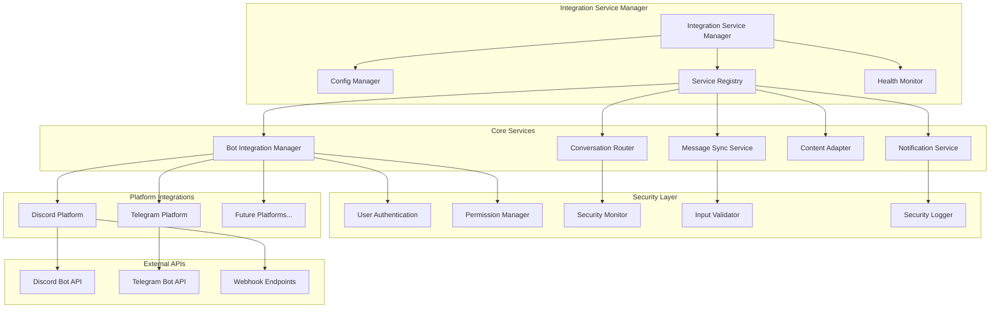
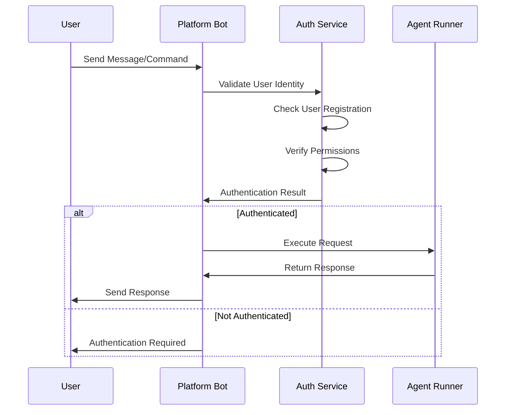
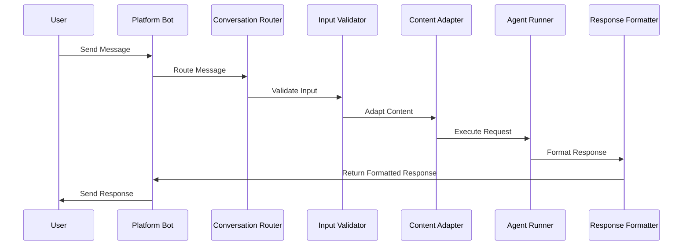
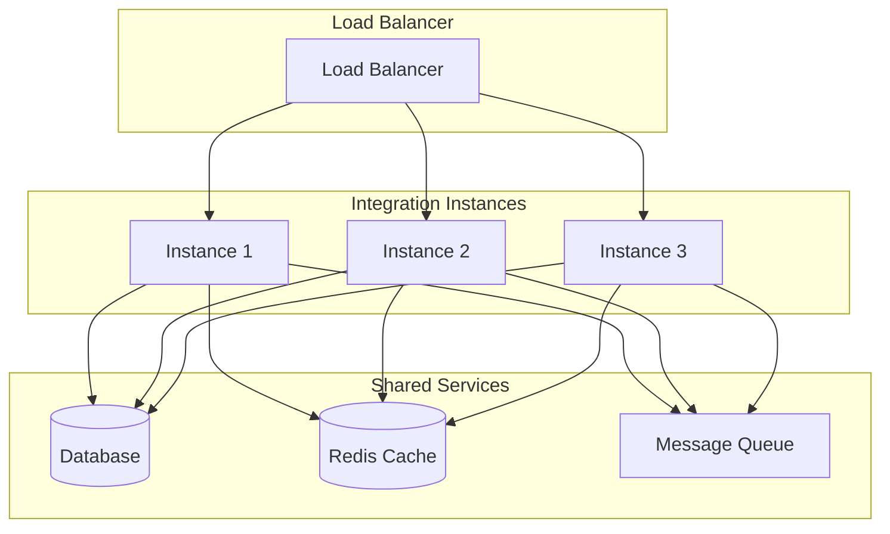

# Integration System Architecture

> Comprehensive guide to EverFern's multi-platform integration system, including Discord, Telegram, and extensible platform support.

## Overview

EverFern's integration system enables the AI agent to operate across multiple platforms, providing seamless bot functionality, message routing, and cross-platform synchronization while maintaining security and user privacy.

## System Architecture

### Integration Service Hierarchy



## Core Components

### 1. Integration Service Manager (`integration-service.ts`)

**Purpose**: Central orchestrator for all integration services and platform connections.

**Key Responsibilities**:
- Service lifecycle management (start, stop, restart)
- Configuration management and validation
- Health monitoring and status reporting
- Error handling and recovery coordination
- Resource allocation and cleanup

**Service Status Tracking**:
```typescript
interface ServiceStatus {
  name: string;
  status: 'stopped' | 'starting' | 'running' | 'error';
  error?: string;
  lastStarted?: Date;
  uptime?: number;
}
```

**Configuration Structure**:
```typescript
interface IntegrationServiceConfig {
  telegram: {
    enabled: boolean;
    botToken: string;
  };
  discord: {
    enabled: boolean;
    botToken: string;
    applicationId: string;
    webhookUrl?: string;
  };
  security: {
    enableMonitoring: boolean;
    enableDataRetention: boolean;
    retentionDays: number;
  };
  notifications: {
    enabled: boolean;
    channels: string[];
  };
}
```

### 2. Bot Integration Manager (`bot-manager.ts`)

**Purpose**: Manages bot instances across different platforms with unified interface.

**Key Features**:
- Multi-platform bot lifecycle management
- Unified command handling and routing
- Rate limiting and quota management
- Error recovery and reconnection logic
- Performance monitoring and optimization

**Bot Management Interface**:
```typescript
interface BotManager {
  registerBot(platform: string, config: BotConfig): Promise<void>;
  startBot(platform: string): Promise<void>;
  stopBot(platform: string): Promise<void>;
  sendMessage(platform: string, channelId: string, message: string): Promise<void>;
  handleIncomingMessage(platform: string, message: IncomingMessage): Promise<void>;
  getBotStatus(platform: string): BotStatus;
}
```

### 3. Platform Implementations

#### Discord Platform (`discord-platform.ts`)

**Purpose**: Discord-specific bot implementation with slash commands and webhook support.

**Key Features**:
- Discord Bot API integration
- Slash command registration and handling
- Webhook URL management for notifications
- Guild and channel permission management
- Rich embed message formatting

**Discord-Specific Capabilities**:
- **Slash Commands**: `/ask`, `/status`, `/help`
- **Webhook Integration**: Automated notifications and updates
- **Permission System**: Role-based access control
- **Rich Embeds**: Formatted responses with metadata
- **File Attachments**: Support for artifacts and generated content

**Implementation Highlights**:
```typescript
class DiscordPlatform implements PlatformIntegration {
  async initialize(config: DiscordConfig): Promise<void> {
    // Bot token validation and client setup
    // Slash command registration
    // Webhook URL configuration
    // Event listener setup
  }

  async handleSlashCommand(interaction: CommandInteraction): Promise<void> {
    // Command validation and routing
    // User permission checking
    // Agent execution coordination
    // Response formatting and sending
  }

  async sendWebhookNotification(content: WebhookContent): Promise<void> {
    // Webhook URL validation
    // Content formatting for Discord
    // Rate limiting compliance
    // Error handling and retry logic
  }
}
```

#### Telegram Platform (`telegram-platform.ts`)

**Purpose**: Telegram-specific bot implementation with message handling and inline keyboards.

**Key Features**:
- Telegram Bot API integration
- Message and callback query handling
- Inline keyboard support for interactive responses
- File upload and download capabilities
- Group chat and private message support

**Telegram-Specific Capabilities**:
- **Command Handling**: `/start`, `/ask`, `/status`, `/help`
- **Inline Keyboards**: Interactive button responses
- **File Sharing**: Document and media file support
- **Group Integration**: Multi-user conversation support
- **Callback Queries**: Interactive response handling

**Implementation Highlights**:
```typescript
class TelegramPlatform implements PlatformIntegration {
  async initialize(config: TelegramConfig): Promise<void> {
    // Bot token validation and API setup
    // Webhook or polling configuration
    // Command menu setup
    // Event handler registration
  }

  async handleMessage(message: TelegramMessage): Promise<void> {
    // Message type detection and validation
    // User authentication and authorization
    // Content extraction and processing
    // Agent execution and response formatting
  }

  async sendInlineKeyboard(chatId: string, text: string, keyboard: InlineKeyboard): Promise<void> {
    // Keyboard layout validation
    // Message formatting
    // API call with error handling
    // Response tracking for callbacks
  }
}
```

## Security Architecture

### 1. User Authentication Service (`user-auth.ts`)

**Purpose**: Manages user identity verification across platforms.

**Authentication Flow**:


**Key Features**:
- Platform-agnostic user identification
- Session management and token validation
- Multi-factor authentication support
- Account linking across platforms
- Audit logging for security events

### 2. Permission Management (`user-permissions.ts`)

**Purpose**: Granular permission control for user actions and agent capabilities.

**Permission Hierarchy**:
```typescript
interface UserPermissions {
  userId: string;
  platform: string;
  permissions: {
    // Basic permissions
    canUseAgent: boolean;
    canExecuteCommands: boolean;
    canAccessFiles: boolean;

    // Advanced permissions
    canUseComputerUse: boolean;
    canExecuteSystemCommands: boolean;
    canModifySettings: boolean;

    // Administrative permissions
    canManageUsers: boolean;
    canViewLogs: boolean;
    canManageIntegrations: boolean;
  };
  restrictions: {
    maxRequestsPerHour: number;
    allowedCommands: string[];
    blockedCommands: string[];
    maxFileSize: number;
  };
}
```

### 3. Security Monitoring (`security-monitor.ts`)

**Purpose**: Real-time security monitoring and threat detection.

**Monitoring Capabilities**:
- **Rate Limiting**: Prevent abuse and spam
- **Anomaly Detection**: Identify unusual usage patterns
- **Content Filtering**: Block malicious or inappropriate content
- **Access Logging**: Comprehensive audit trails
- **Threat Intelligence**: Integration with security databases

**Alert System**:
```typescript
interface SecurityAlert {
  id: string;
  timestamp: Date;
  severity: 'low' | 'medium' | 'high' | 'critical';
  type: 'rate_limit' | 'suspicious_activity' | 'unauthorized_access' | 'content_violation';
  userId: string;
  platform: string;
  details: Record<string, any>;
  actions: SecurityAction[];
}
```

## Message Processing Pipeline

### 1. Message Flow Architecture



### 2. Conversation Router (`conversation-router.ts`)

**Purpose**: Intelligent routing of conversations based on context and user intent.

**Routing Logic**:
- **Platform Detection**: Identify source platform and capabilities
- **User Context**: Maintain conversation history and preferences
- **Intent Classification**: Determine appropriate agent routing
- **Load Balancing**: Distribute requests across available resources
- **Fallback Handling**: Graceful degradation for system issues

### 3. Content Adaptation Service (`content-adapter.ts`)

**Purpose**: Adapts content between different platform formats and capabilities.

**Adaptation Features**:
- **Message Formatting**: Platform-specific markdown and formatting
- **File Handling**: Convert between different file formats
- **Media Processing**: Image, video, and audio adaptation
- **Link Expansion**: URL preview and metadata extraction
- **Emoji and Reaction Mapping**: Cross-platform emoji support

**Content Transformation Pipeline**:
```typescript
interface ContentTransformation {
  input: {
    content: string;
    type: 'text' | 'file' | 'media' | 'embed';
    sourcePlatform: string;
  };
  output: {
    content: string;
    type: 'text' | 'file' | 'media' | 'embed';
    targetPlatform: string;
    metadata?: Record<string, any>;
  };
  transformations: TransformationStep[];
}
```

## Configuration Management

### 1. Configuration Structure

**Platform Configurations**:
```json
{
  "integrations": {
    "discord": {
      "enabled": true,
      "botToken": "${DISCORD_BOT_TOKEN}",
      "applicationId": "${DISCORD_APPLICATION_ID}",
      "webhookUrl": "${DISCORD_WEBHOOK_URL}",
      "guildId": "optional-guild-id",
      "permissions": {
        "defaultRole": "user",
        "adminRoles": ["admin", "moderator"],
        "allowedChannels": ["general", "bot-commands"]
      }
    },
    "telegram": {
      "enabled": true,
      "botToken": "${TELEGRAM_BOT_TOKEN}",
      "webhookUrl": "${TELEGRAM_WEBHOOK_URL}",
      "allowedUsers": ["user1", "user2"],
      "groupSettings": {
        "allowGroups": true,
        "requireMention": true,
        "adminOnly": false
      }
    }
  },
  "security": {
    "rateLimiting": {
      "enabled": true,
      "requestsPerMinute": 10,
      "burstLimit": 5
    },
    "contentFiltering": {
      "enabled": true,
      "blockedWords": ["spam", "abuse"],
      "maxMessageLength": 4000
    },
    "logging": {
      "level": "info",
      "retentionDays": 30,
      "includeContent": false
    }
  }
}
```

### 2. Environment Variable Management

**Secure Credential Storage**:
- Bot tokens stored in environment variables
- Webhook URLs configured per environment
- Database connections isolated per deployment
- API keys rotated regularly with automated updates

## Health Monitoring and Diagnostics

### 1. Health Check System (`health-checkers.ts`)

**Purpose**: Continuous monitoring of integration service health.

**Health Metrics**:
```typescript
interface HealthStatus {
  service: string;
  status: 'healthy' | 'degraded' | 'unhealthy';
  lastCheck: Date;
  responseTime: number;
  metrics: {
    uptime: number;
    requestCount: number;
    errorRate: number;
    memoryUsage: number;
    connectionCount: number;
  };
  issues: HealthIssue[];
}
```

**Monitoring Capabilities**:
- **API Connectivity**: Platform API availability and response times
- **Bot Status**: Bot online status and command responsiveness
- **Resource Usage**: Memory, CPU, and network utilization
- **Error Rates**: Failed requests and error categorization
- **Performance Metrics**: Response times and throughput

### 2. Diagnostic Tools

**Integration Diagnostics**:
- **Connection Testing**: Validate platform API connections
- **Permission Verification**: Check bot permissions and scopes
- **Message Flow Testing**: End-to-end message processing validation
- **Performance Profiling**: Identify bottlenecks and optimization opportunities
- **Error Analysis**: Categorize and analyze integration errors

## Extensibility and Plugin Architecture

### 1. Platform Plugin Interface

**Adding New Platforms**:
```typescript
interface PlatformIntegration {
  name: string;
  version: string;

  initialize(config: PlatformConfig): Promise<void>;
  shutdown(): Promise<void>;

  sendMessage(channelId: string, content: MessageContent): Promise<void>;
  handleIncomingMessage(message: IncomingMessage): Promise<void>;

  getCapabilities(): PlatformCapabilities;
  getStatus(): PlatformStatus;
}
```

### 2. Custom Integration Development

**Development Guidelines**:
1. **Implement Platform Interface**: Follow the standard platform integration interface
2. **Security Compliance**: Implement authentication and authorization
3. **Error Handling**: Robust error handling and recovery mechanisms
4. **Testing**: Comprehensive unit and integration tests
5. **Documentation**: Clear setup and configuration documentation

**Example Custom Platform**:
```typescript
class SlackPlatform implements PlatformIntegration {
  async initialize(config: SlackConfig): Promise<void> {
    // Slack-specific initialization
    // OAuth flow setup
    // Event subscription configuration
    // Bot user setup
  }

  async handleIncomingMessage(message: SlackMessage): Promise<void> {
    // Slack message format parsing
    // User identification and authentication
    // Content extraction and processing
    // Response formatting for Slack
  }
}
```

## Performance Optimization

### 1. Connection Pooling

**Efficient Resource Management**:
- **HTTP Connection Reuse**: Persistent connections to platform APIs
- **WebSocket Management**: Efficient real-time connection handling
- **Database Connection Pooling**: Optimized database access
- **Cache Management**: Intelligent caching of frequently accessed data

### 2. Message Processing Optimization

**Performance Strategies**:
- **Asynchronous Processing**: Non-blocking message handling
- **Batch Operations**: Group similar operations for efficiency
- **Queue Management**: Priority-based message processing
- **Load Balancing**: Distribute load across multiple instances

### 3. Caching Strategy

**Multi-Level Caching**:
- **Response Caching**: Cache common responses and templates
- **User Data Caching**: Cache user preferences and permissions
- **Configuration Caching**: Cache platform configurations
- **Content Caching**: Cache processed content and media

## Deployment and Scaling

### 1. Deployment Architecture

**Multi-Instance Deployment**:


### 2. Scaling Strategies

**Horizontal Scaling**:
- **Stateless Design**: Enable easy horizontal scaling
- **Load Distribution**: Intelligent request routing
- **Auto-scaling**: Dynamic instance management based on load
- **Resource Optimization**: Efficient resource utilization

**Vertical Scaling**:
- **Resource Monitoring**: Track CPU, memory, and network usage
- **Performance Tuning**: Optimize for single-instance performance
- **Capacity Planning**: Predict resource requirements

---

The integration system provides a robust, secure, and extensible foundation for multi-platform AI agent deployment while maintaining high performance and reliability across diverse communication platforms.
