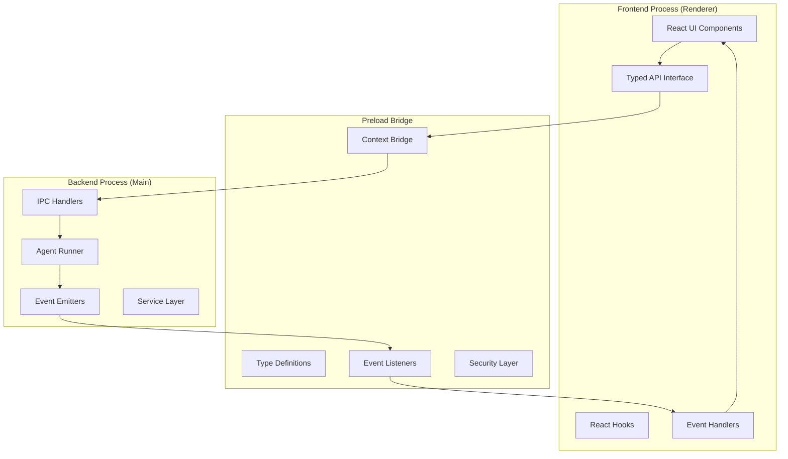
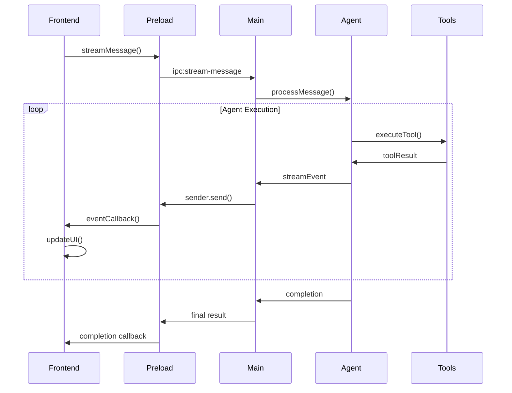

# IPC Communication Architecture

> Detailed documentation of EverFern's inter-process communication system, including event streaming, type safety, and performance optimizations.

## Overview

EverFern uses Electron's IPC (Inter-Process Communication) system to enable secure, typed communication between the frontend (renderer process) and backend (main process). The architecture emphasizes type safety, performance, and real-time streaming capabilities.

## IPC Architecture

### Process Communication Model



## Core Components

### 1. Preload Bridge (`preload/preload.ts`)

**Purpose**: Secure bridge between frontend and backend with typed interfaces.

**Key Features**:
- **Type Safety**: Full TypeScript support with interface definitions
- **Security**: Controlled API exposure through contextBridge
- **Event Management**: Bidirectional event handling
- **Error Handling**: Comprehensive error propagation and handling

**API Structure**:
```typescript
interface ElectronAPI {
  // Window controls
  window: {
    minimize: () => Promise<void>;
    maximize: () => Promise<void>;
    close: () => Promise<void>;
    isMaximized: () => Promise<boolean>;
  };

  // Agent communication
  acp: {
    sendMessage: (message: string, conversationId?: string) => Promise<string>;
    streamMessage: (message: string, conversationId?: string) => Promise<void>;
    abortExecution: () => Promise<void>;
    listProviders: () => Promise<ProviderMeta[]>;
    setProvider: (config: ProviderConfig) => Promise<{ ok: boolean; error?: string }>;
  };

  // System operations
  system: {
    getUsername: () => Promise<string>;
    openFilePicker: (options?: FilePickerOptions) => Promise<string[]>;
    openFolderPicker: () => Promise<string>;
    getPermissionStatus: () => Promise<PermissionStatus>;
  };

  // Event listeners
  onStreamChunk: (callback: (chunk: string) => void) => void;
  onToolCall: (callback: (toolCall: ToolCallEvent) => void) => void;
  onMissionUpdate: (callback: (update: MissionUpdate) => void) => void;
}
```

### 2. IPC Handlers (`main/ipc/`)

**Purpose**: Backend handlers for IPC requests with proper validation and error handling.

#### Agent Handlers (`main/ipc/agent.ts`)

**Core Agent Operations**:
```typescript
// Message processing
ipcMain.handle('acp:send-message', async (event, message: string, conversationId?: string) => {
  try {
    const result = await agentRunner.processMessage(message, conversationId);
    return { success: true, data: result };
  } catch (error) {
    return { success: false, error: error.message };
  }
});

// Streaming message processing
ipcMain.handle('acp:stream-message', async (event, message: string, conversationId?: string) => {
  const eventQueue: StreamEvent[] = [];

  try {
    await agentRunner.streamMessage(message, conversationId, (streamEvent) => {
      // Send real-time events to frontend
      event.sender.send('acp:stream-chunk', streamEvent);
      eventQueue.push(streamEvent);
    });

    return { success: true, events: eventQueue };
  } catch (error) {
    event.sender.send('acp:stream-error', { error: error.message });
    return { success: false, error: error.message };
  }
});

// Execution control
ipcMain.handle('acp:abort-execution', async () => {
  globalAbortManager.setAborted();
  return { success: true };
});
```

#### System Handlers (`main/ipc/system.ts`)

**System Integration Operations**:
```typescript
// File system operations
ipcMain.handle('system:open-file-picker', async (event, options?: FilePickerOptions) => {
  const result = await dialog.showOpenDialog(mainWindow, {
    properties: ['openFile', 'multiSelections'],
    filters: options?.filters || [
      { name: 'All Files', extensions: ['*'] }
    ]
  });

  return result.canceled ? [] : result.filePaths;
});

// Permission management
ipcMain.handle('permissions:status', async () => {
  return await permissionManager.getStatus();
});

ipcMain.handle('permissions:grant', async () => {
  return await permissionManager.requestPermission();
});
```

## Event Streaming System

### 1. Stream Event Types

**Core Event Categories**:
```typescript
type StreamEvent =
  | { type: 'thought'; content: string }
  | { type: 'chunk'; content: string }
  | { type: 'tool_start'; toolName: string; toolArgs: any }
  | { type: 'tool_call'; toolCall: ToolCallRecord }
  | { type: 'mission_step_update'; step: MissionStep; timeline: MissionTimeline }
  | { type: 'mission_phase_change'; phase: string; timeline: MissionTimeline }
  | { type: 'mission_complete'; timeline: MissionTimeline; steps: MissionStep[] }
  | { type: 'parallel_group_start'; groupIndex: number; stepCount: number }
  | { type: 'parallel_group_end'; groupIndex: number; durationMs: number }
  | { type: 'usage'; promptTokens: number; completionTokens: number; totalTokens: number }
  | { type: 'hitl_request'; request: HITLRequest }
  | { type: 'hitl_response'; response: HITLResponse }
  | { type: 'error'; error: string; context?: any }
  | { type: 'done' };
```

### 2. Event Flow Architecture



### 3. Real-time Event Handling

**Frontend Event Processing**:
```typescript
// React hook for stream events
export function useAgentStream() {
  const [events, setEvents] = useState<StreamEvent[]>([]);
  const [isStreaming, setIsStreaming] = useState(false);

  useEffect(() => {
    const handleStreamChunk = (event: StreamEvent) => {
      setEvents(prev => [...prev, event]);

      if (event.type === 'done') {
        setIsStreaming(false);
      }
    };

    window.electronAPI.onStreamChunk(handleStreamChunk);

    return () => {
      window.electronAPI.removeStreamListeners();
    };
  }, []);

  const sendMessage = async (message: string) => {
    setIsStreaming(true);
    setEvents([]);

    try {
      await window.electronAPI.acp.streamMessage(message);
    } catch (error) {
      setEvents(prev => [...prev, { type: 'error', error: error.message }]);
      setIsStreaming(false);
    }
  };

  return { events, isStreaming, sendMessage };
}
```

## Type Safety System

### 1. Shared Type Definitions

**Common Types** (`types/shared.ts`):
```typescript
// Provider types
export type ProviderType = 'openai' | 'anthropic' | 'deepseek' | 'ollama' | 'lmstudio' | 'everfern';

export interface ProviderMeta {
  type: ProviderType;
  name: string;
  description: string;
  requiresApiKey: boolean;
  isLocal: boolean;
  defaultModel: string;
  enabled?: boolean;
}

// Tool execution types
export interface ToolCallRecord {
  toolName: string;
  args: Record<string, any>;
  result: ToolResult;
  duration: number;
  timestamp: Date;
}

// Mission tracking types
export interface MissionStep {
  id: string;
  name: string;
  description: string;
  status: 'pending' | 'in-progress' | 'completed' | 'failed';
  startTime?: number;
  endTime?: number;
  duration?: number;
}
```

### 2. Type Validation

**Runtime Type Checking**:
```typescript
// Parameter validation for IPC calls
function validateIPCParameters<T>(
  params: unknown,
  schema: JSONSchema7
): T {
  const validator = new Ajv();
  const validate = validator.compile(schema);

  if (!validate(params)) {
    throw new Error(`Invalid parameters: ${validator.errorsText(validate.errors)}`);
  }

  return params as T;
}

// Usage in IPC handlers
ipcMain.handle('acp:send-message', async (event, ...args) => {
  const { message, conversationId } = validateIPCParameters(args[0], {
    type: 'object',
    properties: {
      message: { type: 'string', minLength: 1 },
      conversationId: { type: 'string', optional: true }
    },
    required: ['message']
  });

  // Process validated parameters
});
```

## Performance Optimizations

### 1. Event Batching

**Batch Processing for High-Frequency Events**:
```typescript
class EventBatcher {
  private batchQueue: StreamEvent[] = [];
  private batchTimer: NodeJS.Timeout | null = null;
  private readonly batchSize = 10;
  private readonly batchDelay = 16; // ~60fps

  addEvent(event: StreamEvent) {
    this.batchQueue.push(event);

    if (this.batchQueue.length >= this.batchSize) {
      this.flushBatch();
    } else if (!this.batchTimer) {
      this.batchTimer = setTimeout(() => this.flushBatch(), this.batchDelay);
    }
  }

  private flushBatch() {
    if (this.batchQueue.length > 0) {
      // Send batched events to frontend
      mainWindow.webContents.send('acp:stream-batch', this.batchQueue);
      this.batchQueue = [];
    }

    if (this.batchTimer) {
      clearTimeout(this.batchTimer);
      this.batchTimer = null;
    }
  }
}
```

### 2. Memory Management

**Efficient Event Handling**:
```typescript
// Event listener cleanup
class IPCEventManager {
  private listeners: Map<string, Function[]> = new Map();

  addListener(channel: string, callback: Function) {
    if (!this.listeners.has(channel)) {
      this.listeners.set(channel, []);
    }
    this.listeners.get(channel)!.push(callback);
  }

  removeListener(channel: string, callback: Function) {
    const channelListeners = this.listeners.get(channel);
    if (channelListeners) {
      const index = channelListeners.indexOf(callback);
      if (index > -1) {
        channelListeners.splice(index, 1);
      }
    }
  }

  cleanup() {
    // Remove all listeners and clear memory
    for (const [channel, listeners] of this.listeners) {
      listeners.forEach(listener => {
        ipcRenderer.removeListener(channel, listener);
      });
    }
    this.listeners.clear();
  }
}
```

### 3. Connection Pooling

**Efficient Resource Management**:
```typescript
// IPC connection pooling for high-frequency operations
class IPCConnectionPool {
  private connections: Map<string, IPCConnection> = new Map();
  private maxConnections = 10;

  async getConnection(type: string): Promise<IPCConnection> {
    const existing = this.connections.get(type);
    if (existing && existing.isActive()) {
      return existing;
    }

    if (this.connections.size >= this.maxConnections) {
      // Clean up inactive connections
      this.cleanupInactiveConnections();
    }

    const connection = new IPCConnection(type);
    await connection.initialize();
    this.connections.set(type, connection);

    return connection;
  }

  private cleanupInactiveConnections() {
    for (const [type, connection] of this.connections) {
      if (!connection.isActive()) {
        connection.cleanup();
        this.connections.delete(type);
      }
    }
  }
}
```

## Security Model

### 1. Context Isolation

**Secure API Exposure**:
```typescript
// Preload script with context isolation
contextBridge.exposeInMainWorld('electronAPI', {
  // Only expose necessary APIs
  acp: {
    sendMessage: (message: string, conversationId?: string) =>
      ipcRenderer.invoke('acp:send-message', { message, conversationId }),

    // Validate parameters before sending
    setProvider: (config: ProviderConfig) => {
      if (!isValidProviderConfig(config)) {
        throw new Error('Invalid provider configuration');
      }
      return ipcRenderer.invoke('acp:set-provider', config);
    }
  },

  // System APIs with permission checks
  system: {
    openFilePicker: (options?: FilePickerOptions) => {
      // Validate options before sending
      return ipcRenderer.invoke('system:open-file-picker', options);
    }
  }
});
```

### 2. Input Validation

**Comprehensive Parameter Validation**:
```typescript
// Input sanitization and validation
class IPCValidator {
  static validateMessage(message: unknown): string {
    if (typeof message !== 'string') {
      throw new Error('Message must be a string');
    }

    if (message.length === 0) {
      throw new Error('Message cannot be empty');
    }

    if (message.length > 10000) {
      throw new Error('Message too long (max 10000 characters)');
    }

    // Sanitize potentially dangerous content
    return this.sanitizeInput(message);
  }

  static sanitizeInput(input: string): string {
    // Remove potentially dangerous characters or patterns
    return input
      .replace(/[\x00-\x1F\x7F]/g, '') // Remove control characters
      .trim();
  }
}
```

### 3. Permission System

**API Access Control**:
```typescript
// Permission-based API access
class IPCPermissionManager {
  private permissions: Map<string, Set<string>> = new Map();

  checkPermission(channel: string, permission: string): boolean {
    const channelPermissions = this.permissions.get(channel);
    return channelPermissions?.has(permission) ?? false;
  }

  grantPermission(channel: string, permission: string) {
    if (!this.permissions.has(channel)) {
      this.permissions.set(channel, new Set());
    }
    this.permissions.get(channel)!.add(permission);
  }

  revokePermission(channel: string, permission: string) {
    this.permissions.get(channel)?.delete(permission);
  }
}
```

## Error Handling

### 1. Error Propagation

**Structured Error Handling**:
```typescript
interface IPCError {
  code: string;
  message: string;
  details?: any;
  stack?: string;
  timestamp: Date;
}

// Error handling in IPC handlers
ipcMain.handle('acp:send-message', async (event, params) => {
  try {
    const result = await processMessage(params);
    return { success: true, data: result };
  } catch (error) {
    const ipcError: IPCError = {
      code: error.code || 'UNKNOWN_ERROR',
      message: error.message,
      details: error.details,
      stack: error.stack,
      timestamp: new Date()
    };

    // Log error for debugging
    console.error('[IPC Error]', ipcError);

    return { success: false, error: ipcError };
  }
});
```

### 2. Recovery Mechanisms

**Automatic Error Recovery**:
```typescript
// Retry mechanism for failed IPC calls
class IPCRetryManager {
  async callWithRetry<T>(
    channel: string,
    params: any,
    maxRetries: number = 3,
    delay: number = 1000
  ): Promise<T> {
    let lastError: Error;

    for (let attempt = 0; attempt <= maxRetries; attempt++) {
      try {
        const result = await ipcRenderer.invoke(channel, params);

        if (result.success) {
          return result.data;
        } else {
          throw new Error(result.error.message);
        }
      } catch (error) {
        lastError = error;

        if (attempt < maxRetries) {
          // Exponential backoff
          await new Promise(resolve => setTimeout(resolve, delay * Math.pow(2, attempt)));
        }
      }
    }

    throw lastError!;
  }
}
```

## Debugging and Monitoring

### 1. IPC Event Logging

**Comprehensive Event Tracking**:
```typescript
class IPCLogger {
  private logs: IPCLogEntry[] = [];
  private maxLogs = 1000;

  logEvent(type: 'send' | 'receive', channel: string, data: any) {
    const entry: IPCLogEntry = {
      timestamp: Date.now(),
      type,
      channel,
      dataSize: JSON.stringify(data).length,
      data: this.shouldLogData(channel) ? data : '[REDACTED]'
    };

    this.logs.push(entry);

    if (this.logs.length > this.maxLogs) {
      this.logs.shift(); // Remove oldest entry
    }

    // Debug output in development
    if (process.env.NODE_ENV === 'development') {
      console.log(`[IPC ${type.toUpperCase()}]`, channel, entry);
    }
  }

  private shouldLogData(channel: string): boolean {
    // Don't log sensitive data
    const sensitiveChannels = ['acp:set-provider', 'system:credentials'];
    return !sensitiveChannels.includes(channel);
  }

  exportLogs(): IPCLogEntry[] {
    return [...this.logs];
  }
}
```

### 2. Performance Monitoring

**IPC Performance Metrics**:
```typescript
class IPCPerformanceMonitor {
  private metrics: Map<string, ChannelMetrics> = new Map();

  startTiming(channel: string, requestId: string) {
    const start = performance.now();

    if (!this.metrics.has(channel)) {
      this.metrics.set(channel, {
        totalCalls: 0,
        totalTime: 0,
        averageTime: 0,
        minTime: Infinity,
        maxTime: 0,
        errors: 0
      });
    }

    return {
      end: () => {
        const duration = performance.now() - start;
        this.recordTiming(channel, duration);
      }
    };
  }

  private recordTiming(channel: string, duration: number) {
    const metrics = this.metrics.get(channel)!;

    metrics.totalCalls++;
    metrics.totalTime += duration;
    metrics.averageTime = metrics.totalTime / metrics.totalCalls;
    metrics.minTime = Math.min(metrics.minTime, duration);
    metrics.maxTime = Math.max(metrics.maxTime, duration);
  }

  getMetrics(): Map<string, ChannelMetrics> {
    return new Map(this.metrics);
  }
}
```

---

The IPC communication system provides a robust, secure, and performant foundation for frontend-backend communication while maintaining type safety and real-time capabilities essential for AI agent interactions.
