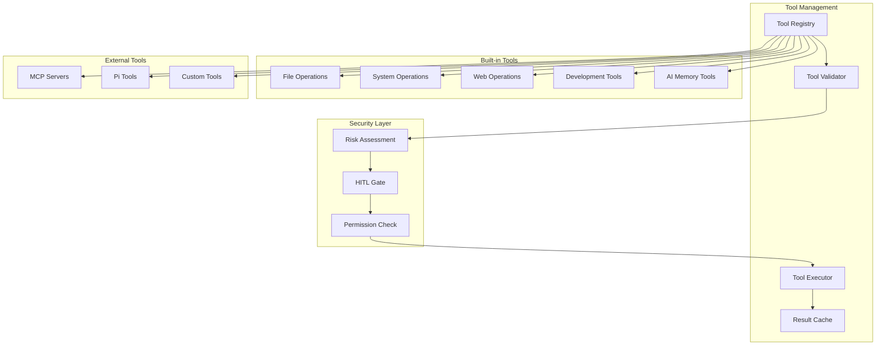
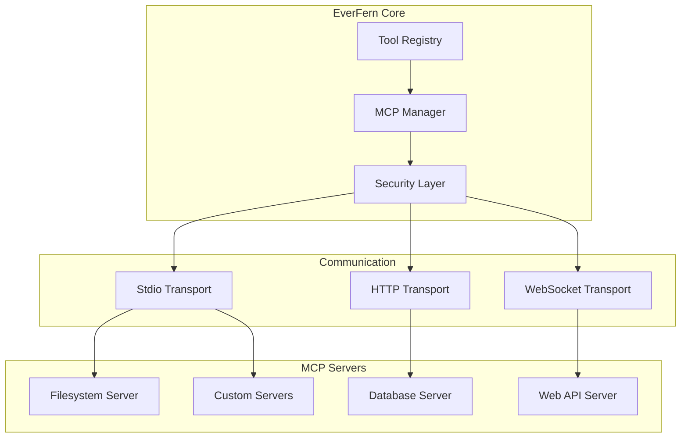
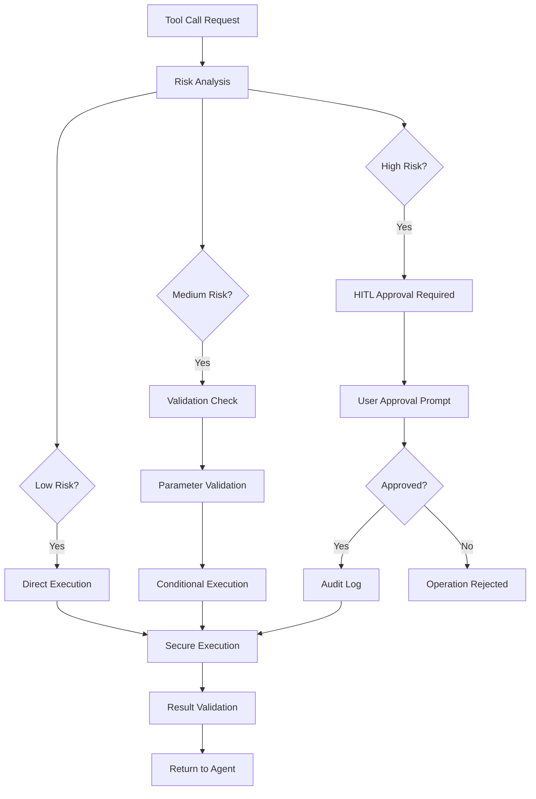

# Tool System Architecture

> Comprehensive guide to EverFern's tool system, including built-in tools, MCP integration, and tool development patterns.

## Overview

EverFern's tool system provides AI agents with capabilities to interact with the operating system, web services, and external applications. The system is designed for extensibility, security, and performance.

## Tool Architecture

### Core Components



## Built-in Tool Categories

### 1. File Operations

#### `readFile` - File Reading
**Purpose**: Read file contents with optional line range specification.

**Parameters**:
- `path`: File path relative to workspace
- `start_line`: Optional starting line number
- `end_line`: Optional ending line number
- `explanation`: Context for intelligent pruning

**Features**:
- Intelligent content pruning for large files
- Line range support for focused reading
- Multiple file format support
- Encoding detection and handling

#### `fsWrite` - File Writing
**Purpose**: Create or overwrite files with content.

**Parameters**:
- `path`: Target file path
- `text`: Content to write

**Features**:
- Automatic directory creation
- Atomic write operations
- Backup creation for existing files
- Content validation

#### `strReplace` - Surgical File Editing
**Purpose**: Replace specific text sections in files with precision.

**Parameters**:
- `path`: Target file path
- `oldStr`: Exact text to replace
- `newStr`: Replacement text

**Features**:
- Exact string matching with whitespace sensitivity
- Uniqueness validation to prevent ambiguous replacements
- Context preservation around changes
- Rollback capability on errors

#### `deleteFile` - File Deletion
**Purpose**: Safely delete files with confirmation.

**Parameters**:
- `targetFile`: File path to delete
- `explanation`: Reason for deletion

**Features**:
- Confirmation prompts for important files
- Trash/recycle bin integration where available
- Audit logging of deletions

### 2. System Operations

#### `executePwsh` - Shell Command Execution
**Purpose**: Execute PowerShell/bash commands with proper isolation.

**Parameters**:
- `command`: Command to execute
- `cwd`: Working directory
- `timeout`: Execution timeout
- `explanation`: Purpose of command

**Features**:
- Cross-platform shell detection
- Timeout handling and process termination
- Output streaming for long-running commands
- Environment variable isolation

#### `computer_use` - GUI Automation
**Purpose**: Perform desktop automation through vision-language models.

**Parameters**:
- `task`: Description of GUI task to perform
- `screenshot`: Optional screenshot for context

**Features**:
- Vision-language model integration
- Coordinate mapping and element detection
- Application launching and control
- Error recovery and retry logic

#### `system_files` - System File Management
**Purpose**: Organize and manage system files safely.

**Parameters**:
- `action`: Operation type (list, move, copy, delete)
- `source`: Source path or pattern
- `destination`: Target location

**Features**:
- Batch operations with progress tracking
- Undo functionality for reversible operations
- Permission validation
- Conflict resolution

### 3. Web Operations

#### `remote_web_search` - Web Search
**Purpose**: Search the web for current information.

**Parameters**:
- `query`: Search query (max 200 characters)

**Features**:
- Multiple search engine support
- Result ranking and relevance scoring
- Content licensing compliance
- Rate limiting and caching

#### `webFetch` - Web Content Extraction
**Purpose**: Fetch and extract content from web pages.

**Parameters**:
- `url`: Target URL (HTTPS only)
- `mode`: Extraction mode (full, truncated, selective, rendered)
- `searchPhrase`: Optional phrase for selective extraction

**Features**:
- JavaScript rendering for dynamic content
- Content extraction and cleaning
- Security validation for URLs
- Caching for performance

### 4. Development Tools

#### `readCode` - Intelligent Code Reading
**Purpose**: Read and analyze code files with AST parsing.

**Parameters**:
- `path`: File or directory path
- `selector`: Optional symbol name to search
- `language`: Programming language (auto-detected)

**Features**:
- AST-based structure analysis
- Symbol search and navigation
- Signature extraction for large files
- Multi-language support

#### `getDiagnostics` - Code Diagnostics
**Purpose**: Get compile, lint, and type errors from code files.

**Parameters**:
- `paths`: Array of file paths to check

**Features**:
- Language server integration
- Real-time error detection
- Severity classification
- Fix suggestions where available

#### `semanticRename` - Safe Refactoring
**Purpose**: Rename symbols across the codebase with reference updates.

**Parameters**:
- `path`: File containing the symbol
- `line`: Line number of symbol
- `character`: Character position
- `oldName`: Current symbol name
- `newName`: New symbol name

**Features**:
- Cross-file reference tracking
- Validation of rename safety
- Atomic operations with rollback
- Language-aware renaming

#### `smartRelocate` - File Movement with Import Updates
**Purpose**: Move files while automatically updating import statements.

**Parameters**:
- `sourcePath`: Current file path
- `destinationPath`: New file path

**Features**:
- Automatic import/reference updates
- Dependency graph analysis
- Conflict detection and resolution
- VS Code-style file movement

### 5. AI Memory Tools

#### `memory_save` - Persistent Memory Storage
**Purpose**: Save information for future reference across conversations.

**Parameters**:
- `key`: Memory key identifier
- `content`: Information to store
- `tags`: Optional categorization tags

**Features**:
- Semantic indexing for retrieval
- Automatic expiration policies
- Conflict resolution for duplicate keys
- Privacy-preserving storage

#### `memory_search` - Memory Retrieval
**Purpose**: Search and retrieve previously stored information.

**Parameters**:
- `query`: Search query
- `limit`: Maximum results to return
- `tags`: Optional tag filters

**Features**:
- Semantic similarity search
- Relevance ranking
- Context-aware retrieval
- Result summarization

### 6. Planning and Control Tools

#### `todo_write` - Task Management
**Purpose**: Create and manage task lists with status tracking.

**Parameters**:
- `tasks`: Array of task descriptions
- `status`: Task status (pending, in_progress, completed)

**Features**:
- Hierarchical task organization
- Progress tracking and reporting
- Dependency management
- Time estimation and tracking

#### `ask_user_question` - Human Interaction
**Purpose**: Request user input with structured options.

**Parameters**:
- `questions`: Array of question objects
- `multiSelect`: Allow multiple selections
- `preview`: Optional preview content

**Features**:
- Rich question formatting
- Option validation and constraints
- Timeout handling
- Response validation

#### `present_files` - File Presentation
**Purpose**: Present created files to the user with metadata.

**Parameters**:
- `files`: Array of file paths and descriptions

**Features**:
- File preview generation
- Metadata extraction
- Access permission validation
- User notification

## MCP (Model Context Protocol) Integration

### MCP Architecture



### MCP Server Types

#### 1. Command-based Servers
Execute as separate processes with stdio communication.

**Configuration Example**:
```json
{
  "mcpServers": {
    "filesystem": {
      "command": "uvx",
      "args": ["mcp-server-filesystem", "/allowed/path"],
      "env": {
        "LOG_LEVEL": "INFO"
      }
    }
  }
}
```

#### 2. Docker-based Servers
Run in isolated containers for enhanced security.

**Configuration Example**:
```json
{
  "mcpServers": {
    "database": {
      "docker": "my-org/db-mcp-server:latest",
      "volumes": ["/data:/container/data:ro"],
      "env": {
        "DB_CONNECTION": "sqlite:///data/app.db"
      }
    }
  }
}
```

#### 3. HTTP/WebSocket Servers
Connect to remote MCP servers over network protocols.

**Configuration Example**:
```json
{
  "mcpServers": {
    "api-server": {
      "url": "https://api.example.com/mcp",
      "auth": {
        "type": "bearer",
        "token": "${API_TOKEN}"
      }
    }
  }
}
```

### MCP Tool Discovery

1. **Server Registration**: MCP servers register available tools
2. **Tool Enumeration**: EverFern queries servers for tool definitions
3. **Schema Validation**: Tool schemas validated against MCP specification
4. **Security Assessment**: Tools categorized by risk level
5. **Integration**: Tools added to agent tool registry

## Tool Security Model

### Risk Assessment Framework



### Risk Categories

#### Low Risk Tools
- File reading operations
- Web search and content fetching
- Memory operations (read-only)
- Code analysis and diagnostics

**Characteristics**:
- No system modifications
- Read-only operations
- Reversible actions
- Limited scope impact

#### Medium Risk Tools
- File writing and editing
- Non-destructive system operations
- Memory modifications
- Network communications

**Characteristics**:
- Reversible modifications
- Limited system impact
- User data modifications
- Controlled scope

#### High Risk Tools
- File deletion and system modifications
- Shell command execution
- System configuration changes
- Irreversible operations

**Characteristics**:
- Irreversible actions
- System-wide impact
- Security implications
- Data loss potential

### Permission Model

#### Tool Permissions
- **READ**: Access to read files and system information
- **WRITE**: Ability to modify files and user data
- **EXECUTE**: Permission to run commands and scripts
- **NETWORK**: Access to network resources
- **SYSTEM**: System-level operations and configurations

#### Permission Inheritance
- Agents inherit base permissions from their configuration
- Tools can request elevated permissions for specific operations
- User approval required for permission escalation
- Permissions logged and auditable

## Tool Development Guide

### Creating Custom Tools

#### 1. Tool Interface Implementation

```typescript
interface AgentTool {
  name: string;
  description: string;
  parameters: ToolParameters;
  execute: (args: any, logger?: (msg: string) => void) => Promise<ToolResult>;
  riskLevel?: 'low' | 'medium' | 'high';
  requiredPermissions?: Permission[];
}
```

#### 2. Parameter Schema Definition

```typescript
interface ToolParameters {
  type: 'object';
  properties: Record<string, ParameterDefinition>;
  required: string[];
  additionalProperties?: boolean;
}
```

#### 3. Execution Implementation

```typescript
async function execute(args: ToolArgs, logger?: Logger): Promise<ToolResult> {
  try {
    // 1. Validate input parameters
    const validatedArgs = validateParameters(args, this.parameters);

    // 2. Check permissions and risk level
    await checkPermissions(this.requiredPermissions);

    // 3. Execute tool logic
    const result = await performOperation(validatedArgs);

    // 4. Validate and format output
    return formatResult(result);

  } catch (error) {
    // 5. Handle errors gracefully
    return handleError(error);
  }
}
```

### Tool Registration

#### 1. Static Registration
Add tools to the base tool registry in `tools_manager.ts`:

```typescript
export function getBaseTools(runner: AgentRunner): AgentTool[] {
  return [
    // ... existing tools
    myCustomTool,
  ];
}
```

#### 2. Dynamic Registration
Register tools at runtime through the tool registry:

```typescript
runner.registerTool(myCustomTool);
```

#### 3. MCP Registration
Implement MCP server for external tool integration:

```python
from mcp.server import Server
from mcp.types import Tool, TextContent

server = Server("my-custom-server")

@server.list_tools()
async def list_tools():
    return [
        Tool(
            name="my_tool",
            description="Custom tool functionality",
            inputSchema={
                "type": "object",
                "properties": {
                    "param1": {"type": "string"},
                    "param2": {"type": "number"}
                },
                "required": ["param1"]
            }
        )
    ]

@server.call_tool()
async def call_tool(name: str, arguments: dict):
    if name == "my_tool":
        result = perform_custom_operation(arguments)
        return TextContent(type="text", text=str(result))
```

## Performance Optimizations

### Tool Execution Optimization

#### 1. Parallel Execution
- Independent tools execute concurrently
- Dependency analysis for optimal scheduling
- Resource pooling for expensive operations

#### 2. Result Caching
- Semantic caching for expensive operations
- TTL-based cache invalidation
- Cache warming for frequently used tools

#### 3. Connection Pooling
- Reuse connections for network-based tools
- Connection lifecycle management
- Automatic connection recovery

### Memory Management

#### 1. Resource Cleanup
- Automatic cleanup of temporary resources
- Memory leak prevention
- File handle management

#### 2. Streaming Operations
- Stream large file operations
- Chunked processing for big data
- Progress reporting for long operations

## Monitoring and Telemetry

### Tool Usage Metrics

- **Execution Frequency**: Track tool usage patterns
- **Performance Metrics**: Execution time and resource usage
- **Error Rates**: Success/failure statistics
- **User Satisfaction**: Feedback on tool effectiveness

### Debug Information

- **Execution Traces**: Detailed logs of tool executions
- **Parameter Validation**: Input/output validation logs
- **Error Stack Traces**: Comprehensive error reporting
- **Performance Profiling**: Bottleneck identification

### Audit Logging

- **Security Events**: High-risk tool executions
- **Permission Changes**: Permission escalations and modifications
- **User Interactions**: HITL approvals and rejections
- **System Modifications**: Changes to system state

---

The tool system provides a robust, secure, and extensible foundation for AI agent capabilities while maintaining user control and system security through comprehensive validation, permission management, and audit logging.
